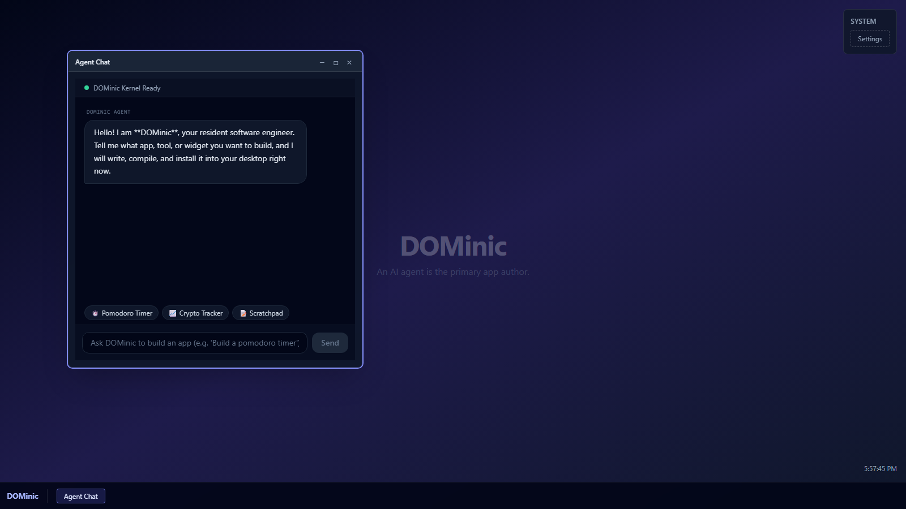

# DOMinic



A web-based desktop operating system running in a browser tab, where
an AI agent is the primary app author: the user talks, the agent
answers, and the apps it writes install, run, and persist like
first-party software.

## What DOMinic is

- A desktop-metaphor OS shell — window manager, taskbar, and app
  registry — that degrades cleanly to a bottom-nav sheet and stacked
  windows on phone viewports.
- A chat-driven agent surface that streams from virtually any LLM
  provider; users bring their own API keys, which stay in their
  browser and travel per-request, never at rest on a server.
- A platform for agent-authored apps: Vue single-file components
  compiled at runtime in the browser, persisting their source in a
  virtual filesystem and loading npm dependencies from a vetted ESM
  CDN.

Application code is landing on `main` throughout the hackathon. See
[Running DOMinic](#running-dominic) to start it, and the decision
records below for why it is built this way.

## Documentation

| Path | Contents |
| --- | --- |
| [docs/JUDGES.md](docs/JUDGES.md) | **Judges start here:** five-minute tour of the demo, the code behind it, and what is deferred |
| [docs/adrs/](docs/adrs/README.md) | Architecture decision records (MADR 4.0) |
| [NEXT.md](NEXT.md) | Post-hackathon roadmap & deferred architecture |
| [QUESTIONS.md](QUESTIONS.md) | Open technical decisions for the hackathon team |
| [docs/agents/use-okf.md](docs/agents/use-okf.md) | OKF v0.2 frontmatter convention for docs |
| [docs/agents/rubric.md](docs/agents/rubric.md) | Hackathon judging rubric and win strategy |
| [docs/agents/demo-path.md](docs/agents/demo-path.md) | The two-minute demo as rubric-mapped beats |
| [docs/agents/coordination.md](docs/agents/coordination.md) | Multi-agent task coordination over GitHub Issues (`/coordinate`) |
| [docs/agents/coordination-best-practices.md](docs/agents/coordination-best-practices.md) | Coordination playbook v1 (superseded; kept for the record) |
| [docs/agents/coordination-best-practices-2.md](docs/agents/coordination-best-practices-2.md) | Coordination playbook v2 (superseded; kept for the record) |
| [docs/agents/coordination-best-practices-3.md](docs/agents/coordination-best-practices-3.md) | Active coordination playbook — sprint evidence and enforceable invariants |
| [docs/superpowers/specs/](docs/superpowers/specs/) | Design specs from brainstorming sessions |
| [docs/superpowers/plans/](docs/superpowers/plans/) | Implementation plans derived from specs |
| [docs/research/](docs/research/README.md) | The Q01 question and its three answers behind the coordination playbooks |

### Decision highlights

The accepted ADR series establishes the platform's foundations with an
explicit **Hackathon POC Golden Path** in each record:

- [0001](docs/adrs/0001-feature-slices-with-domain-driven-organization.md)
  Feature slices with domain-driven organization
- [0002](docs/adrs/0002-strict-typescript-and-lint-toolchain.md)
  Strict TypeScript and lint toolchain
- [0003](docs/adrs/0003-pinia-per-domain-stores.md)
  Pinia per-domain stores
- [0004](docs/adrs/0004-dominic-os-shell-and-taskbar.md)
  DOMinic OS shell and taskbar
- [0005](docs/adrs/0005-agent-chat-via-vercel-ai-sdk-with-server-side-provider-proxy.md)
  Agent chat via Vercel AI SDK with server-side provider proxy
- [0006](docs/adrs/0006-agent-authored-runtime-compiled-components.md)
  Agent-authored runtime-compiled components
- [0007](docs/adrs/0007-virtual-filesystem-with-pluggable-storage-drivers.md)
  Virtual filesystem with pluggable storage drivers
- [0008](docs/adrs/0008-runtime-npm-dependency-loading-via-esm-sh-with-vetting.md)
  Runtime NPM dependency loading via esm.sh with vetting
- [0009](docs/adrs/0009-cors-first-networking-with-chrome-masking-proxy-fallback.md)
  CORS-first networking with Chrome-masking proxy fallback
- [0010](docs/adrs/0010-agent-app-interface-and-tool-protocol.md)
  Agent app interface and tool protocol

## Hackathon POC: Team Workstreams

To deliver a working, high-impact POC within a few hours, the 5-engineer
team divides into clear, parallel workstreams:

1. **SDE 1 (OS Shell & Window Manager)**: Desktop wallpaper, taskbar,
   window frames with drag/minimize/maximize/close via `@vueuse/core`.
2. **SDE 2 (Agent Chat & Tool Calling)**: `/api/chat` route, streaming UI,
   system prompt, and `install_app` / `update_app` tool execution.
3. **SDE 3 (Runtime App Engine)**: In-process `vue3-sfc-loader` wrapper,
   Tailwind styling, and error boundary with auto-fix reporting.
4. **SDE 4 (Persistence & App Registry)**: Lightweight VFS over
   `localStorage`, app registry hydration, and Settings persistence.
5. **SDE 5 (Integration, Polish & Curated Demos)**: Built-in Settings app,
   demo showcase apps (synthwave pomodoro, crypto ticker), and visual
   polish.

## Running DOMinic

```bash
npm install
npm run dev          # Nuxt dev server, default http://localhost:3000
```

Open **Settings** from the taskbar and paste an API key for your model
provider. The key stays in your browser and travels per request; the
server never stores it (ADR 0005). Then open the Agent Chat and
describe an app: it is written, compiled in the browser, installed
to the taskbar, and kept across reloads.

Other scripts: `npm run build`, `npm run typecheck`, `npm run lint:md`.

## Development

Markdown is linted with markdownlint-cli2 (80-column prose) and
carries OKF frontmatter.
Node 24 LTS is the standard runtime — see
[ADR 0011](docs/adrs/0011-node-24-lts-runtime-standard.md); `nvm use`
picks it up from the checked-in `.nvmrc`.

```bash
npm install
npm run lint:md
```

A pre-commit hook runs the lint automatically; write with the
conventions in [docs/agents/use-okf.md](docs/agents/use-okf.md) and
[docs/adrs/template.md](docs/adrs/template.md).

## License

DOMinic is licensed under the
[GNU Affero General Public License v3.0 or later](LICENSE)
(AGPL-3.0-or-later). Since DOMinic is a network-run application,
section 13 of the AGPL requires that users interacting with it over a
network are offered the corresponding source.
