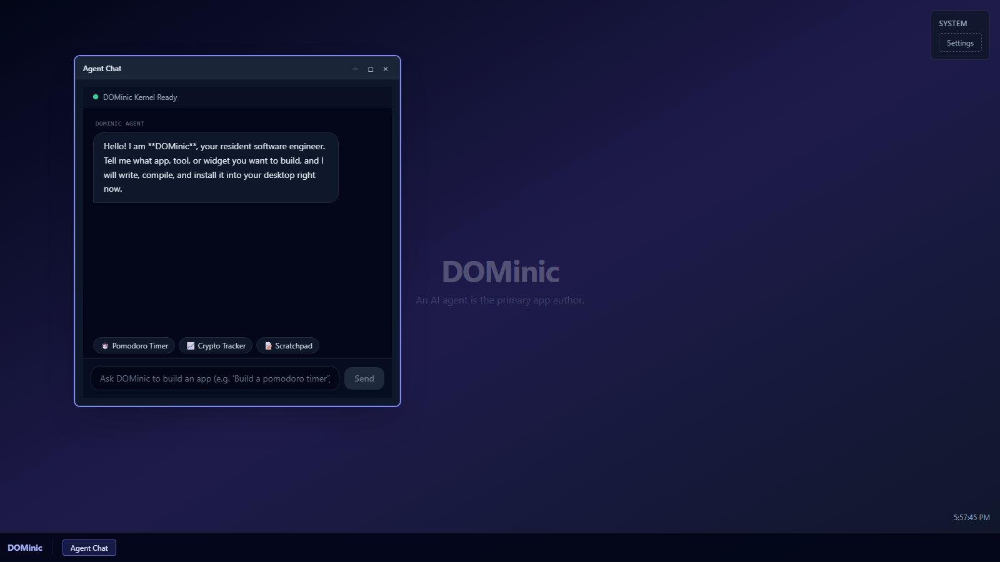

# DOMinic



A web-based desktop operating system running in a browser tab, where
an AI agent is the primary app author: the user talks, the agent
answers, and the apps it writes install, run, and persist like
first-party software.

## What DOMinic is

- A desktop-metaphor OS shell — window manager, taskbar, and app
  registry — built for desktop browsers, with a phone layout below
  768px: windows stack as full-width cards and the taskbar becomes a
  scrollable bottom sheet (ADR 0004; roadmap step 3.1).
- A chat-driven agent surface that streams from virtually any LLM
  provider; users bring their own API keys, which stay in their
  browser and travel per-request, never at rest on a server.
- A platform for agent-authored apps: Vue single-file components
  compiled at runtime in the browser, persisting their source in a
  virtual filesystem and loading npm dependencies from the esm.sh
  CDN. Dependencies are not vetted yet: the vetting gate decided in
  ADR 0008 is roadmap step 1.3.

The hackathon proof of concept shipped the whole core loop; the project
now follows the sequenced roadmap in [NEXT.md](NEXT.md). See
[Running DOMinic](#running-dominic) to start it, and the decision
records below for why it is built this way.

## Documentation

| Path | Contents |
| --- | --- |
| [docs/JUDGES.md](docs/JUDGES.md) | **Judges start here:** five-minute tour of the demo, the code behind it, and what is deferred |
| [docs/adrs/](docs/adrs/README.md) | Architecture decision records (MADR 4.0) |
| [NEXT.md](NEXT.md) | Sequenced roadmap, collaborator lanes, and the issue -> PR -> merge loop |
| [QUESTIONS.md](QUESTIONS.md) | Open questions register with post-hackathon outcomes |
| [docs/agents/use-okf.md](docs/agents/use-okf.md) | OKF v0.2 frontmatter convention for docs |
| [docs/agents/rubric.md](docs/agents/rubric.md) | Hackathon judging rubric and win strategy |
| [docs/agents/demo-path.md](docs/agents/demo-path.md) | The two-minute demo as rubric-mapped beats |
| [.claude/skills/coordinate/SKILL.md](.claude/skills/coordinate/SKILL.md) | Multi-agent task coordination over GitHub Issues (`/coordinate`): protocol, parameters, working agreements |
| [docs/superpowers/specs/](docs/superpowers/specs/) | Design specs from brainstorming sessions |
| [docs/superpowers/plans/](docs/superpowers/plans/) | Implementation plans derived from specs |
| [docs/research/](docs/research/README.md) | The Q01 question and its three answers behind the coordination playbooks |

### Decision highlights

The accepted ADR series establishes the platform's foundations. Each
record carries a hackathon golden path (historical since ADR 0012) and
an as-built reconciliation:

- [0001](docs/adrs/0001-feature-slices-with-domain-driven-organization.md)
  Feature slices with domain-driven organization
- [0002](docs/adrs/0002-strict-typescript-and-lint-toolchain.md)
  Strict TypeScript and lint toolchain
- [0003](docs/adrs/0003-pinia-per-domain-stores.md)
  Pinia per-domain stores
- [0004](docs/adrs/0004-dominic-os-shell-and-taskbar.md)
  DOMinic OS shell and taskbar
- [0005](docs/adrs/0005-agent-chat-via-vercel-ai-sdk-with-server-side-provider-proxy.md)
  Agent chat via Vercel AI SDK with server-side provider proxy
- [0006](docs/adrs/0006-agent-authored-runtime-compiled-components.md)
  Agent-authored runtime-compiled components
- [0007](docs/adrs/0007-virtual-filesystem-with-pluggable-storage-drivers.md)
  Virtual filesystem with pluggable storage drivers
- [0008](docs/adrs/0008-runtime-npm-dependency-loading-via-esm-sh-with-vetting.md)
  Runtime NPM dependency loading via esm.sh with vetting
- [0009](docs/adrs/0009-cors-first-networking-with-chrome-masking-proxy-fallback.md)
  CORS-first networking with Chrome-masking proxy fallback
- [0010](docs/adrs/0010-agent-app-interface-and-tool-protocol.md)
  Agent app interface and tool protocol
- [0011](docs/adrs/0011-node-24-lts-runtime-standard.md)
  Node 24 LTS runtime standard
- [0012](docs/adrs/0012-end-of-hackathon-scope.md)
  End of the hackathon scope

## Roles

Development continues part-time with a lane per collaborator - the
paths they own, their roadmap steps, and a reviewer rotation - defined
in [NEXT.md](NEXT.md#roles-and-working-agreement). The hackathon's
five workstreams are recorded in the git history and in
[docs/submission-form.md](docs/submission-form.md).

## Running DOMinic

```bash
npm install
npm run dev          # Nuxt dev server, default http://localhost:3000
```

Open **Settings** from the System panel (top right) and paste an API
key for your model provider. The key stays in your browser and
travels per request; the server never stores it (ADR 0005). Then
describe an app in the Agent Chat, which opens with the desktop: it
is written, compiled in the browser, installed to the taskbar, and
kept across reloads.

Other scripts: `npm run build`, `npm run typecheck`, `npm run lint`
(`npm run lint:fix` applies fixes), `npm run lint:md`, and
`npm run test:e2e` (see [tests/e2e/README.md](tests/e2e/README.md)).

## Development

Code is linted with ESLint (`eslint.config.mjs`), including a rule
against imports between feature slices (ADR 0001). Markdown is
linted with markdownlint-cli2 (80-column prose) and carries OKF
frontmatter.
Node 24 LTS is the standard runtime — see
[ADR 0011](docs/adrs/0011-node-24-lts-runtime-standard.md); `nvm use`
picks it up from the checked-in `.nvmrc`.

```bash
npm install
npm run lint
npm run lint:md
```

A pre-commit hook lints the Markdown and runs ESLint with `--fix` on
staged files; type-checking runs in CI (ADR 0002). Write with the
conventions in [docs/agents/use-okf.md](docs/agents/use-okf.md) and
[docs/adrs/template.md](docs/adrs/template.md).

## License

DOMinic is licensed under the
[GNU Affero General Public License v3.0 or later](LICENSE)
(AGPL-3.0-or-later). Since DOMinic is a network-run application,
section 13 of the AGPL requires that users interacting with it over a
network are offered the corresponding source.
