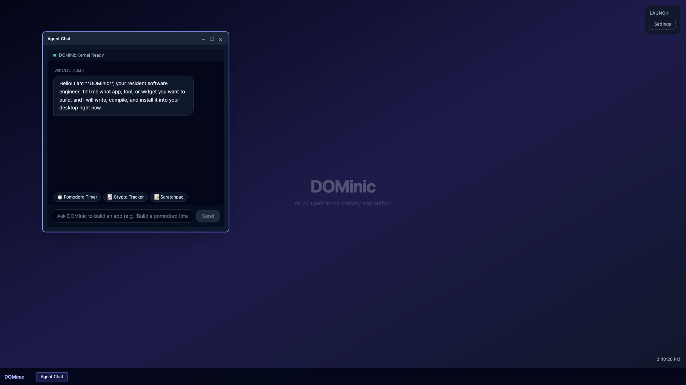
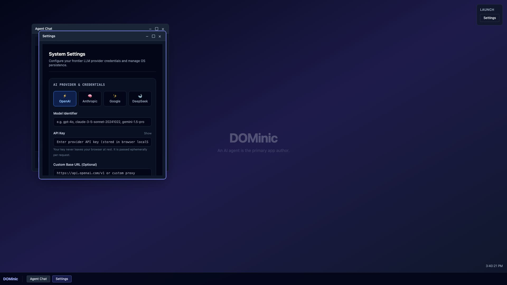
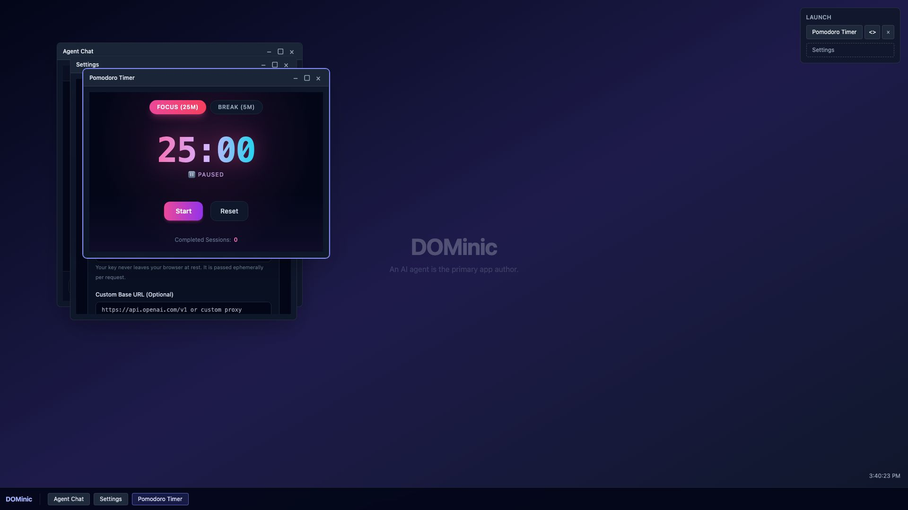

# DOMinic for judges — a five-minute tour

DOMinic is a desktop operating system in a browser tab where the AI agent
is the primary app author. You describe an app; the agent writes a Vue
component, the browser compiles it, it installs to the taskbar, opens,
and is still there after a reload. This page maps what you saw in the
video to the code on `main`, and says what is not there yet.

## The core loop in sixty seconds, by file

1. **`app/app.vue`** boots the shell: `Taskbar.vue`, one `WindowFrame`
   per open window, the Agent Chat window open by default, and the
   launcher hydrated from the registry (`listApps()`).
2. **`app/features/chat/components/ChatWindow.vue`** takes the prompt;
   **`composables/useAgentChat.ts`** streams it to the server and
   handles tool results client-side.
3. **`server/api/chat.post.ts`** runs the Vercel AI SDK with the system
   prompt (`chat/prompts/systemPrompt.ts`) and two typed tools
   (`chat/tools/schemas.ts`): `install_app` and `update_app`. The
   provider key arrives per request from the browser and is never
   stored (ADR 0005).
4. When the model calls `install_app`, the client writes
   `apps/<id>/index.vue` through **`app/features/shared/vfs.ts`**
   (localStorage-backed) and registers the app in
   **`app/features/apps/registry/registry.ts`** (`registry.json`).
5. **`app/features/os/stores/os.ts`** opens a window;
   **`app/features/apps/runner/DynamicAppRunner.vue`** compiles the
   source in the browser with `vue3-sfc-loader`
   (**`runner/loader.ts`**: host modules `vue`, `@vueuse/core`,
   `lucide-vue-next`, `canvas-confetti` are pre-resolved; anything else
   resolves through `esm.sh`). An `onErrorCaptured` boundary renders an
   error card with **Ask Agent to Fix**, which posts the trace back into
   the chat.
6. Reload the tab: `app.vue` re-reads `registry.json`, the launcher and
   taskbar list the app again, and opening it recompiles the stored
   source. Ask for a change and `update_app` rewrites the file in place.

## ADR-to-code map

| ADR | Decision | Realized in |
| --- | --- | --- |
| 0001 | Feature slices | `app/features/{os,chat,apps,settings,shared}` |
| 0002 | Strict TS + lint toolchain | `tsconfig.json`; markdownlint in `.husky/pre-commit` and CI (type gates deferred for the sprint, see NEXT.md) |
| 0003 | Pinia per-domain stores | `os/stores/os.ts`, `chat/stores/chat.ts`, `apps/stores/apps.ts`, `settings/stores/settings.ts` |
| 0004 | OS shell and taskbar | `os/components/Taskbar.vue`, `os/components/WindowFrame.vue`, `settings/components/SettingsApp.vue` |
| 0005 | Agent chat via Vercel AI SDK, per-request keys | `server/api/chat.post.ts`, `chat/composables/useAgentChat.ts`, `settings/stores/settings.ts` |
| 0006 | Runtime-compiled agent components | `apps/runner/DynamicAppRunner.vue`, `apps/runner/loader.ts` |
| 0007 | Virtual filesystem | `shared/vfs.ts` (localStorage driver), `apps/registry/registry.ts` |
| 0008 | Runtime npm loading via esm.sh | `apps/runner/loader.ts` (pre-resolved host modules; `esm.sh/<pkg>?bundle` fallback) |
| 0009 | CORS-first networking | Direct `fetch` from apps only; the proxy route is deferred (NEXT.md) |
| 0010 | Agent app interface and tool protocol | `chat/tools/schemas.ts`, `chat/prompts/systemPrompt.ts`, `apps/fixtures/pomodoro-timer/manifest.json` |

Each ADR carries a **Hackathon POC (Golden Path)** section stating what
was built today versus deferred. `docs/adrs/README.md` is the index.

## Run it

```bash
npm install
npm run dev          # http://localhost:3000
```

Open **Settings** from the launcher and paste a provider key (OpenAI is
the default; Anthropic and Google presets exist). The key stays in your
browser and is sent per request. Then paste the frozen demo prompt from
`docs/agents/demo-path.md` into Agent Chat:

> Build a beautiful retro synthwave Pomodoro focus timer with 25-minute
> work and 5-minute break cycles, start/pause/reset controls, and
> confetti celebration on finish.

Without a key you can still exercise the install path: in the browser
console, `window.__dominic.installFixture("pomodoro-timer")` installs
the shipped agent-authored fixture through the same VFS and registry
code `install_app` uses; `window.__dominic.reset()` wipes the OS.

## What it looks like







![Reopened from the launcher after a reload][shot4]

[shot4]: assets/04-after-reload-reopened-from-launcher.jpg

The last two were produced with `installFixture` rather than a live
model call, because they were captured without a provider key. The
video shows the live path.

## Real on `main` versus deferred

**Real:** shell with draggable windows and taskbar; streaming chat with
typed `install_app` / `update_app` tools; in-browser SFC compilation;
error boundary with Ask Agent to Fix; localStorage VFS with registry
hydration across reloads; Settings with provider presets and Reset OS;
launcher Uninstall and View Source; a shipped pomodoro fixture.

**Deferred** (all listed with rationale in [`NEXT.md`](../NEXT.md)):
sandboxed iframe isolation for agent code, the automated npm vetting
gate, the multi-driver VFS (IndexedDB/OPFS), the CORS proxy and its
SSRF hardening, mobile degradation of the shell, type-checked pre-commit
gates, and the auto-healing error loop.

## Known limitations you will notice

- **No proxy:** apps can only reach CORS-enabled APIs directly.
- **localStorage only:** roughly 5 MB; fine for dozens of apps, not
  for assets.
- **No iframe isolation:** agent-authored code runs in the OS's page;
  a crashing app is caught by the boundary, a hostile one is not.
- **Styles can leak:** an unscoped `<style>` in a generated app can
  touch the shell; the system prompt asks for Tailwind or scoped styles.
- **Keys transit the server in memory** per request; they are never
  logged or stored (ADR 0005), but this is not a hardened deployment.
- **Tailwind play CDN** in development prints a production warning.

## How this was built

Five engineers, five different coding agents, one afternoon, one
repository. Decisions are ADRs; the agents coordinated through GitHub
Issues with a small protocol (`docs/agents/coordination.md`,
`docs/agents/coordination-best-practices-2.md`). The judging rubric and
the demo beats we built to are in `docs/agents/rubric.md` and
`docs/agents/demo-path.md`.
